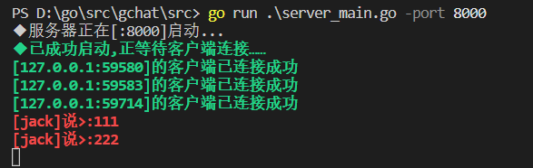
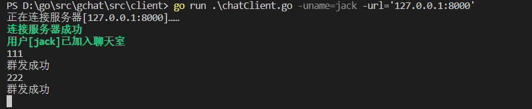
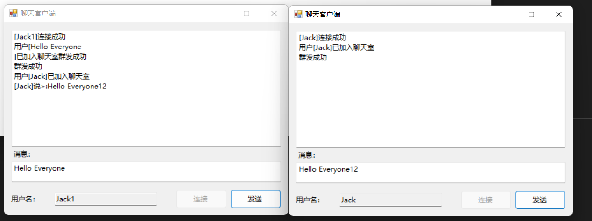

# 实战:并发聊天

项目来源与《Go并发编程实战》一书，为方便学习，进行记录和使用，项目可以拉取至本地运行。

## 使用步骤

### 拉取项目代码：

```
cd ${GOPATH}/src
git clone git@github.com:rodason/gchat.git
```

### 安装MySQL

下载默认安装即可

```
https://dev.mysql.com/get/Downloads/MySQLInstaller/mysql-installer-community-5.7.38.0.msi
```

`执行mysql.sql文件`

### 启动服务端

`go run .\chatServer.go`

### 启动客户端

#### 终端模式

`go run .\chatClient.go -uname=jack1`

#### windows可执行文件

``执行目录下的ChatClient.exe 备注：该exe文件是使用c#进行开发的，若需要改动的，可打开ChatClient.rar文件源码进行更改``

### 效果图如下

#### 服务端



#### 客户端





### 功能描述

```
1,支持并发聊天
2,支持个性化用户名
3,支持群发和单发
4,支持消息持久化到数据库
5,支持把用户（超时）提出功能
6,支持系统命令，如查询当前连接数和协程数($NUMCONN$:获取CONNECTION数量,$NUMGO$:获取协程数量)
7,客户端有可视化界面
```
